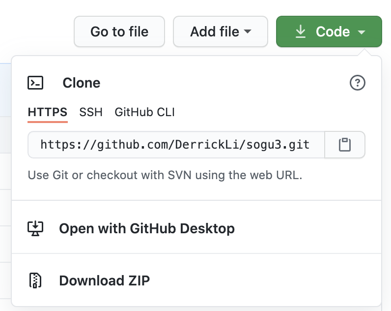
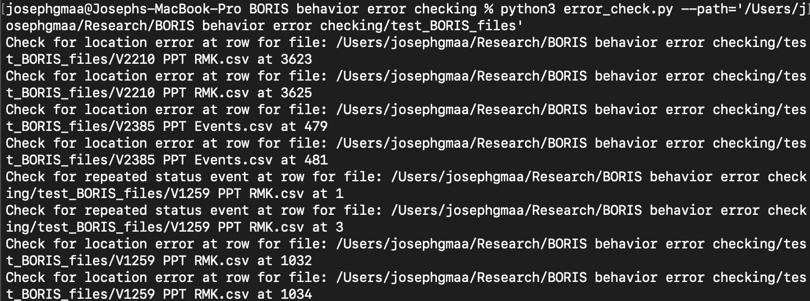

# BORIS Behavior File Error Checker

#### <ins>Created by Joseph Maa</ins>
#### Email: josephgmaa@berkeley.edu


This script takes in multiple BORIS behavior files and checks for event chronology errors and animal position errors.

#### <ins>Directions</ins>

1. Change directory to wanted directory (using cd on the command line) and git clone the repository locally by going to Terminal and typing in the command:

```
git clone <your-https-url-here>
```



1. Open the terminal and move to the "BORIS behavior error checking" directory.
1. Extract .csv files from behavior files in BORIS and place in a new folder in the directory. 
1. Place BORIS files in folder "BORIS_files_input" as **.csv** files. If they are not .csv fi:les, the program will error! 
1. Determine absolute path to "BORIS_files_input". This is mine below, but yours will differ based on the directory path
```
"/Users/josephgmaa/Research/BORIS behavior error checking/boris_files_input"
```
1. Start virtual environment by typing 
```
pipenv shell
```
* Followed by this command to install python dependencies
```
pipenv install
```
1. Run python script with command: 
```
python3 error_check.py --path=YOUR_PATH_HERE
```

#### <ins>Testing:</ins>

If there are errors during runtime, try running the .csvs in the test_boris_files


