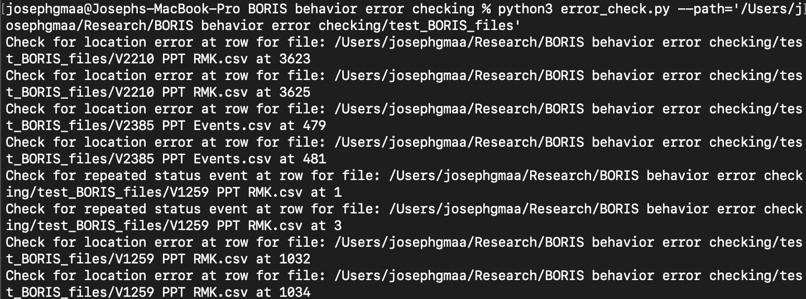

# BORIS Behavior File Error Checker

#### <ins>Created by Joseph Maa</ins>
#### Email: josephgmaa@berkeley.edu


This script takes in multiple BORIS behavior files and checks for event chronology errors and animal position errors.

#### <ins>Directions</ins>


1. Open the terminal and move to the "BORIS behavior error checking" directory.
1. Extract .csv files from behavior files in BORIS. 
1. Place BORIS files in folder "BORIS_files_input" as **.csv** files. If they are not .csv files, the program will error! 
1. Determine absolute path to "BORIS_files_input". Use this in command below. 
```
"/Users/josephgmaa/Research/BORIS behavior error checking/boris_files_input"
```
1. Run python script with command: "python3 error_check.py --path=YOUR_PATH_HERE"

#### <ins>Testing (Currently working on automating):</ins>

1. If there are errors during runtime, try running the .csvs in the test_boris_files


